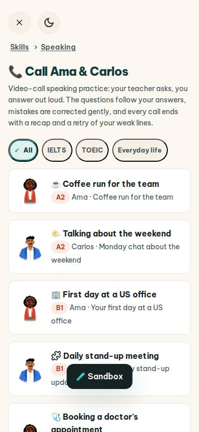
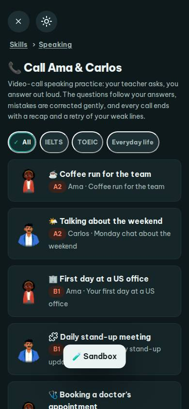
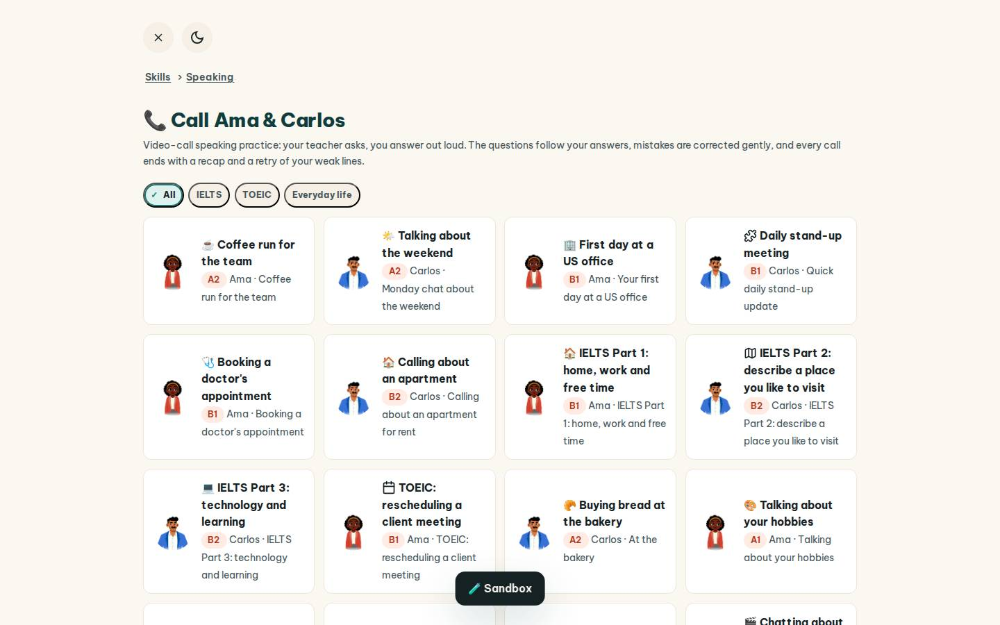
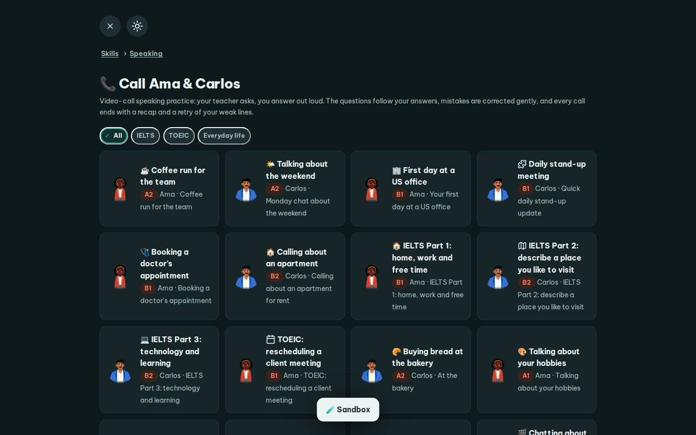

# #/call

Điểm: **94** · độ phủ 86 % · /call

- Chức năng: 100
- Lỗi JS: 100
- Rỗng/lỗi/tải: 100
- Back/Thoát: 100
- Tương phản: 100
- Chạm ≥44: 92
- Bố cục: 100
- i18n 15: 100
- Hiệu năng: 50
- Độ đẹp: ∅

## Lỗi
- [tap] main#view>div.call-flt>button.chip – "All" vùng chạm 59×36 < 44px
- [perf] LCP 6792 ms · CLS 0 · TBT 67 ms

## Ảnh
390l 
390d 
1440l 
1440d 
