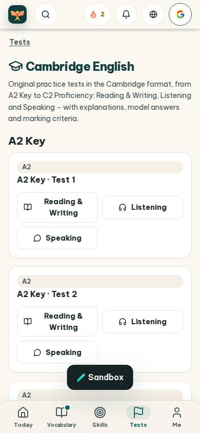
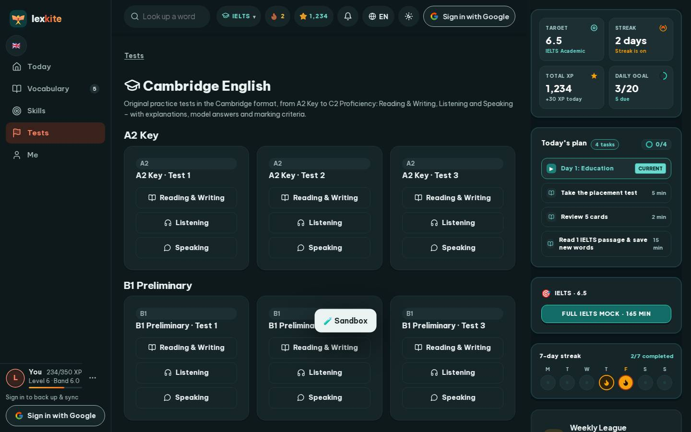

# #/cambridge

Điểm: **93** · độ phủ 100 % · /cambridge

- Chức năng: 100
- Lỗi JS: 100
- Rỗng/lỗi/tải: 100
- Back/Thoát: –
- Tương phản: 100
- Chạm ≥44: 100
- Bố cục: 100
- i18n 15: 100
- Hiệu năng: 50
- Độ đẹp: 82

## Lỗi
- [perf] LCP 10440 ms · CLS 0.0039 · TBT 78 ms
- [beauty] Dark toast notification obscures content and breaks visual flow
- [beauty] Top navigation bar feels crowded with mixed icon styles
- [beauty] Lacks the playful, character-driven illustration style of Duolingo

## Ảnh
390l 
390d 
1440l 
1440d 
