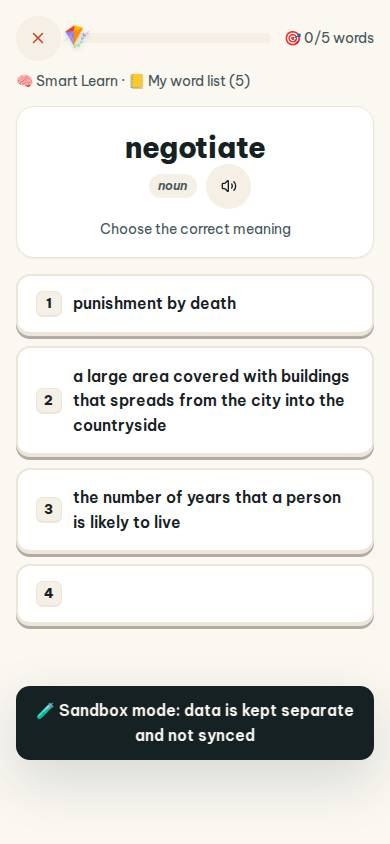
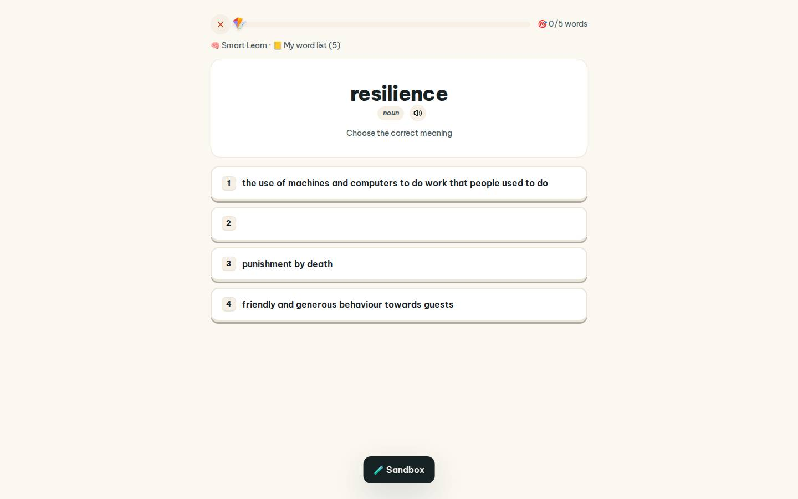

# #/practice

Điểm: **87** · độ phủ 100 % · /practice

- Chức năng: 100
- Lỗi JS: 100
- Rỗng/lỗi/tải: 100
- Back/Thoát: 100
- Tương phản: 100
- Chạm ≥44: 100
- Bố cục: 100
- i18n 15: 13
- Hiệu năng: 83
- Độ đẹp: 72

## Lỗi
- [i18n] ar: thiếu dịch «noun»
- [i18n] de: thiếu dịch «noun»
- [i18n] es: thiếu dịch «noun»
- [i18n] fr: thiếu dịch «noun»
- [perf] LCP 3680 ms · CLS 0.0007 · TBT 75 ms
- [beauty] Option 4 is empty, looking broken/unfinished
- [beauty] Generic beige palette feels flat vs Duolingo's vibrant brand
- [beauty] No character/illustration integration, feels utilitarian

## Ảnh
390l 
390d 
1440l 
1440d 
