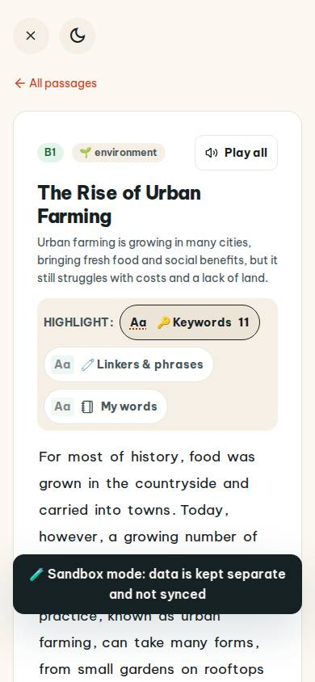
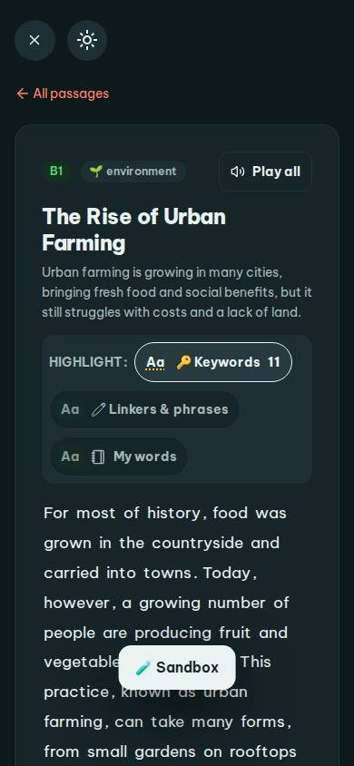
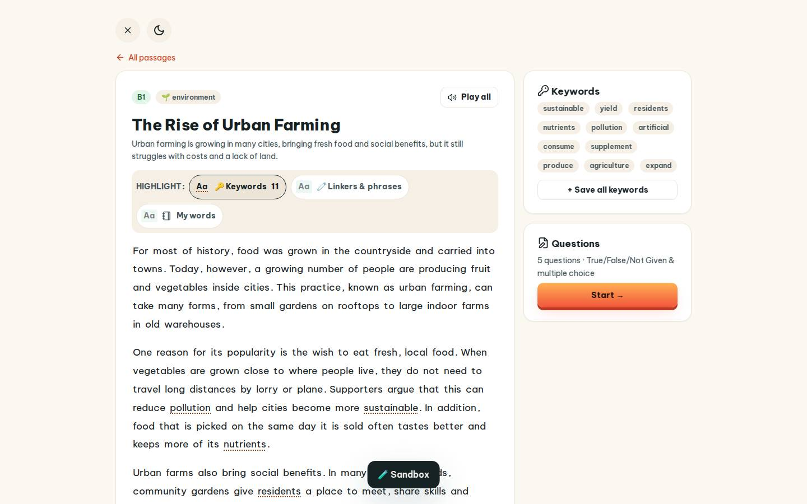

# #/read

Điểm: **82** · độ phủ 86 % · /read

- Chức năng: 100
- Lỗi JS: 100
- Rỗng/lỗi/tải: 67
- Back/Thoát: 100
- Tương phản: 80
- Chạm ≥44: 76
- Bố cục: 85
- i18n 15: 13
- Hiệu năng: 100
- Độ đẹp: ∅

## Lỗi
- [state] error: ReadHL is not defined
- [contrast] .hl-sw.link
- [contrast] .mine.hl-sw
- [tap] button#readAloud – "Play all" vùng chạm 103×36 < 44px
- [tap] div.card>div.row>button.chip – "sustainable" vùng chạm 92×24 < 44px
- [tap] button#addKw – "+ Save all keywords" vùng chạm 250×36 < 44px
- [layout] div#hlBar>button.hl-chip.mine – "Aa My words" rớt xuống đứng một mình ở dòng cuối của div#hlBar
- [i18n] ar: thiếu dịch «For» · thiếu dịch «Today»
- [i18n] de: thiếu dịch «For» · thiếu dịch «Today»
- [i18n] es: thiếu dịch «For» · thiếu dịch «Today»
- [i18n] fr: thiếu dịch «For» · thiếu dịch «Today»

## Ảnh
390l 
390d 
1440l 
1440d 
