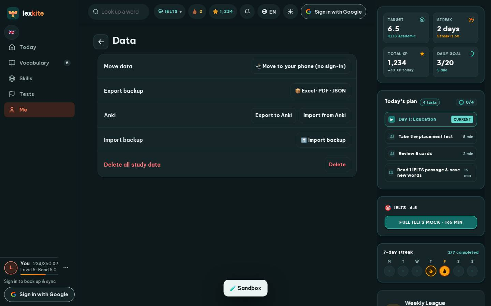

# #/settings/data

Điểm: **95** · độ phủ 86 % · /settings/data

- Chức năng: 100
- Lỗi JS: 100
- Rỗng/lỗi/tải: 100
- Back/Thoát: –
- Tương phản: 100
- Chạm ≥44: 100
- Bố cục: 100
- i18n 15: 100
- Hiệu năng: 59
- Độ đẹp: ∅

## Lỗi
- [perf] LCP 5340 ms · CLS 0.0033 · TBT 30 ms

## Ảnh
390l 
390d 
1440l 
1440d 
