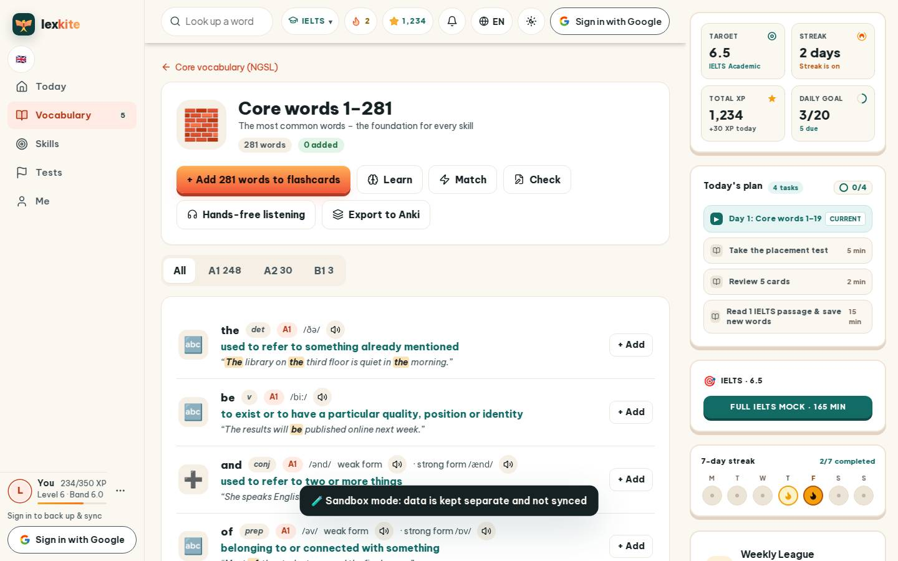

# #/topic/ngsl1

Điểm: **80** · độ phủ 86 % · /topic/ngsl1

- Chức năng: 100
- Lỗi JS: 100
- Rỗng/lỗi/tải: 100
- Back/Thoát: –
- Tương phản: 100
- Chạm ≥44: 84
- Bố cục: 70
- i18n 15: 13
- Hiệu năng: 46
- Độ đẹp: ∅

## Lỗi
- [tap] div.flex.items-center>h3.text-base.font-extrabold>a.w – "the" vùng chạm 27×48 < 44px
- [tap] button#tpMore – "View all 281 words expand_more" vùng chạm 171×34 < 44px
- [layout] div.w-full.max-w-[420px]>main.px-4.pt-3>div.rounded-3xl.p-5 – nội dung tràn ngang 32px bị cắt: "main.px-4.pt-3>div.rounded-3xl.p-5>div.absol
- [layout] div.w-full.max-w-[420px]>header.sticky.top-0>a.inline-flex.items-center – "arrow_back Core vocabulary (NGSL)" bị div.flex.items-center>a.fle
- [i18n] ar: thiếu dịch «to»
- [i18n] de: thiếu dịch «to»
- [i18n] es: thiếu dịch «to»
- [i18n] fr: thiếu dịch «to»
- [perf] LCP 9984 ms · CLS 0.0001 · TBT 339 ms

## Ảnh
390l 
390d 
1440l 
1440d 
