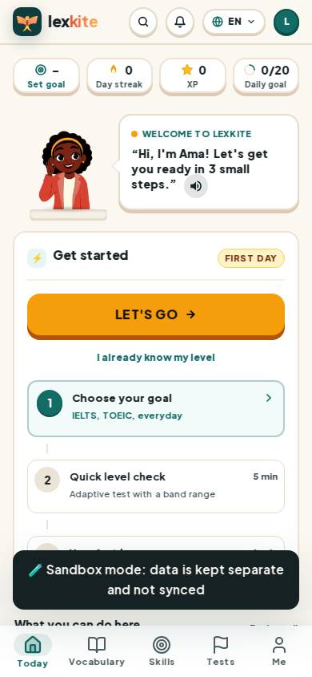
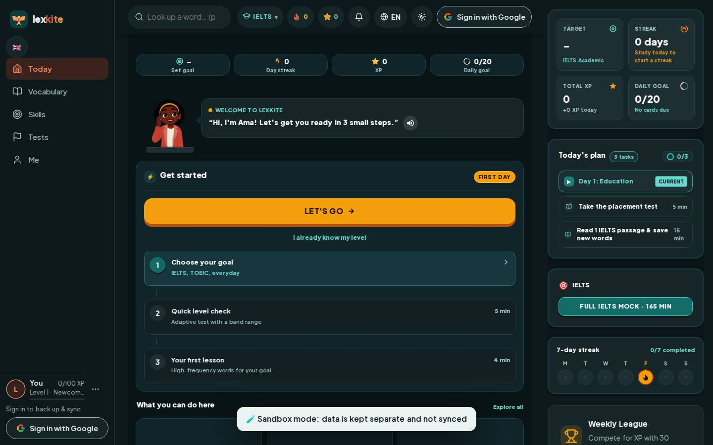

# #/welcome

Điểm: **93** · độ phủ 100 % · /welcome

- Chức năng: 100
- Lỗi JS: 100
- Rỗng/lỗi/tải: 100
- Back/Thoát: –
- Tương phản: 100
- Chạm ≥44: 100
- Bố cục: 81
- i18n 15: 100
- Hiệu năng: 75
- Độ đẹp: 82

## Lỗi
- [layout] span#xpPill – nội dung tràn ngang 23px bị cắt
- [layout] div.lv-row>div.grow.lv-tx>div.tiny.muted – chữ bị cắt "…" (115>111px)
- [perf] LCP 1068 ms · CLS 0.0679 · TBT 1722 ms
- [beauty] Dark toast overlay obscures content and bottom nav
- [beauty] Character illustration feels pasted, not integrated with card
- [beauty] Top stat cards feel cramped and unevenly spaced

## Ảnh
390l 
390d 
1440l 
1440d 
