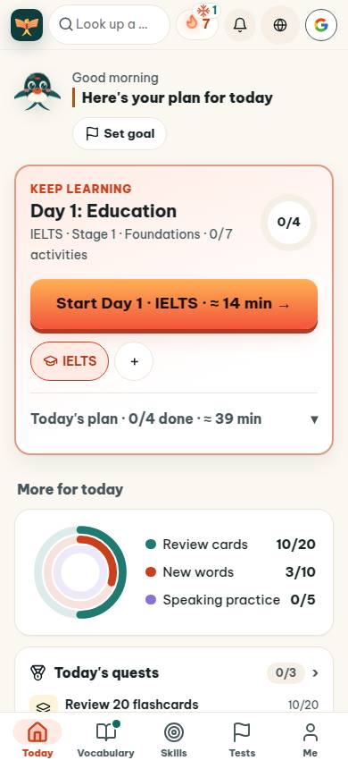
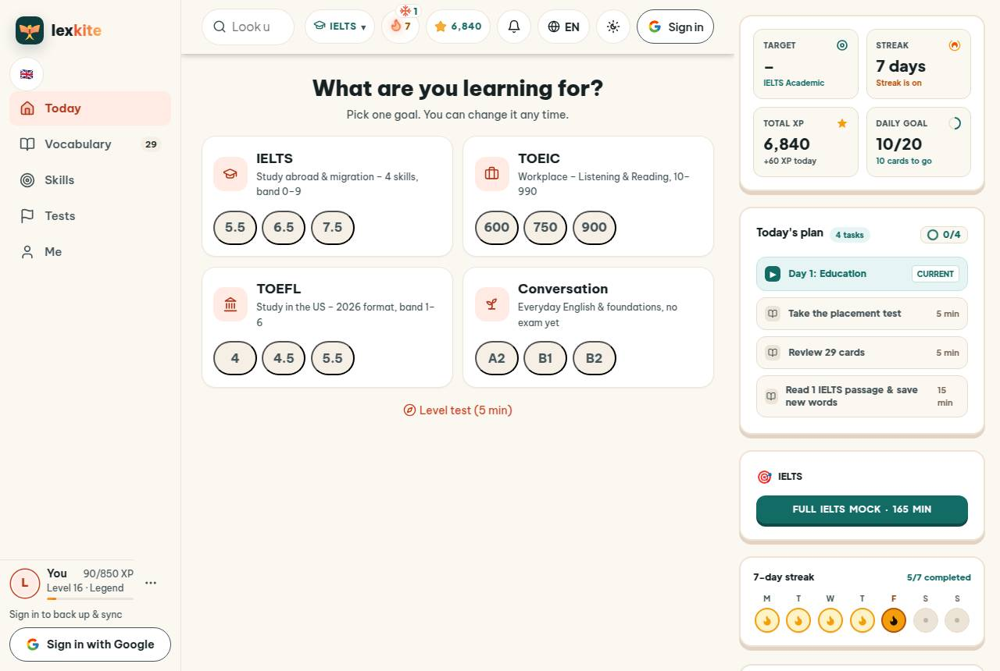
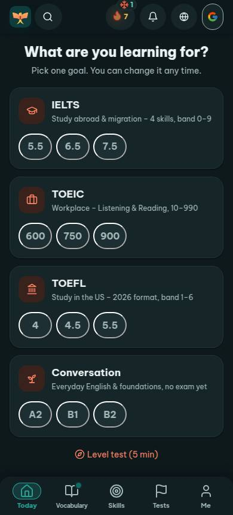

# Add-on › app #/home

Điểm: **96** · độ phủ 55 % · app/index.html?demo=1&hl=en#/home

- Chức năng: 100
- Lỗi JS: 100
- Rỗng/lỗi/tải: ∅
- Back/Thoát: ∅
- Tương phản: 100
- Chạm ≥44: 76
- Bố cục: 85
- i18n 15: ∅
- Hiệu năng: ∅
- Độ đẹp: ∅

## Lỗi
- [tap] div.main>header.topbar>a.brand – "" vùng chạm 36×36 < 44px
- [tap] button#avatarBtn – "Sign in with Google" vùng chạm 36×44 < 44px
- [tap] div.ux1-pick>p.center>a.small – "Level test (5 min)" vùng chạm 139×18 < 44px
- [layout] span#xpPill – nội dung tràn ngang 122px bị cắt

## Ảnh
390l 
1280l 
390d 
1280d 
