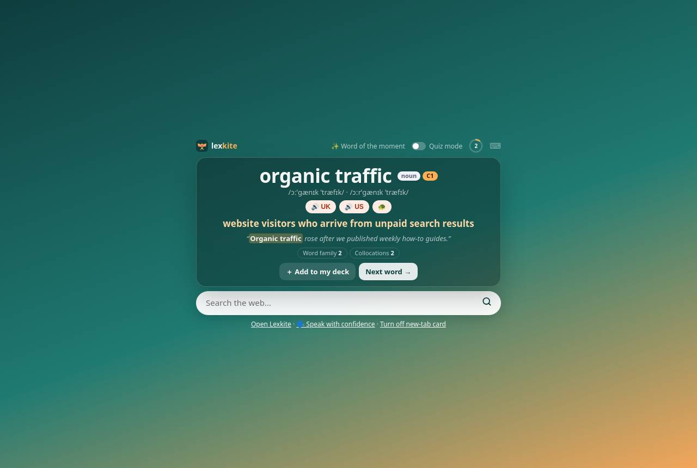
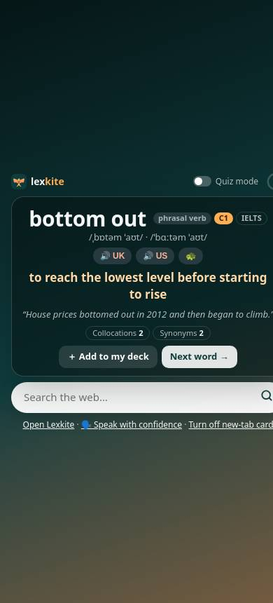

# Add-on › tab mới

Điểm: **85** · độ phủ 71 % · newtab.html

- Chức năng: 100
- Lỗi JS: 100
- Rỗng/lỗi/tải: ∅
- Back/Thoát: –
- Tương phản: 100
- Chạm ≥44: 20
- Bố cục: 70
- i18n 15: ∅
- Hiệu năng: ∅
- Độ đẹp: 72

## Lỗi
- [tap] article#ntCard>div.spks>button.spk – "🔊 UK" vùng chạm 56×24 < 44px
- [tap] button#ntSlow – "🐢" vùng chạm 35×24 < 44px
- [tap] button#ntEx – "“Clubbing is not really my thing; I pref" vùng chạm 344×19 < 44px
- [tap] article#ntCard>div.more>button – "Word family1" vùng chạm 91×20 < 44px
- [tap] button#ntAdd – "＋ Add to my deck" vùng chạm 140×32 < 44px
- [layout] html – trang rộng 408px > 390px (cuộn ngang)
- [layout] button#ntGo – "Search" nằm ngoài màn hình (x 340…392 / 390)
- [beauty] Large empty gradient space below content feels unbalanced
- [beauty] Bottom link row looks like raw browser text
- [beauty] No character or illustration integration

## Ảnh
390l 
1280l 
390d 
1280d 
